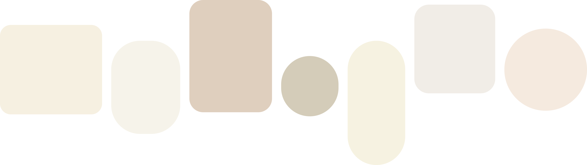

  <h1>
    Publishing Project :  
    일상의 온도를 결정하는 가구 큐레이션  
    MELT 
  </h1>
    
  

    👉 <a href="https://yoon-j11.github.io/MELT/" target="_blank"><b>[ Click Here ] MELT 라이브 데모 사이트 보러가기</b></a> 👈
      
    🎨 <a href="https://www.figma.com/design/ITT2INDjpptNOs64DV1NgF/MELT-%ED%94%84%EB%A1%9C%EC%A0%9D%ED%8A%B8?node-id=0-1&t=V6mGZ9AvHVS5UM2X-1" target="_blank"><b>[ Figma ] 디자인 작업 보러가기</b></a> 🎨
  

 

___

 

### ➊ Project Overview
* **프로젝트명**: `MELT`
* **개요**: 모던하고 따뜻한 원목 감성을 지향하는 가구 브랜드 'MELT'의 브랜드 메인 페이지
* **목표**: 단순한 시각적 포트폴리오를 넘어, 실제 카페24 등 상용 쇼핑몰 템플릿 제작을 상정하고 실무적인 예외 상황과 사용자 인터랙션을 완벽하게 고려한 완성도 높은 웹 서비스 구현
* **진행 형태**: 1인 프로젝트 (브랜딩, 디자인, 퍼블리싱 전 과정 수행)
  
 

 

### ➋ Concept & Design
* **브랜드 컨셉**: '일상의 온도를 녹이는(Melt) 가구'
* **디자인 키워드**: `아이보리 톤` · `현대적 모던함` · `불규칙한 조형미` · `과감한 타이포그래피`
* **디자인 특징**: 웹 쇼핑몰의 전형적인 틀을 깨는 감각적인 디자인 요소를 담으면서도, 실제 서비스 운영 시 발생할 수 있는 사용자의 모든 행동 반경을 염두에 두고 레이아웃 구축

  

### ➌ Tech Stack
* **Language / Markup**: 
  
  
  
  

* **Library**: 
  

* **Tool**: 
  

### ➍ Section Highlights
#### 1. 헤더와 푸터 컴포넌트 모듈화
> * 헤더와 푸터를 별도 파일로 분리하여 `fetch` API로 동적 로딩
> * 페이지가 늘어나도 중앙 관리 한 번으로 전체 메뉴와 푸터를 일괄 수정할 수 있는 확장성 확보

#### 2. 헤더의 복합 인터렉션 설계
> * 스크롤 방향 및 위치에 따라 헤더를 유연하게 노출/숨김(`Hide/Show`) 처리
> * 호버 상태, 최상단 복귀, 아래로 스크롤 등 복합적인 경우의 수를 변수(`lastScrollY`, `isHovering`)로 관리하여 인터랙션 충돌 방지

#### 3. 철저하고 완벽한 반응형 UX 구현
> * 헤더, 푸터뿐만 아니라 **모든 페이지 섹션에 걸쳐** 다양한 디바이스 환경에서 깨짐 없는 레이아웃 적용
> * 리사이즈(`Resize`) 이벤트를 적극 활용하여 기기 전환 시 발생할 수 있는 모바일 메뉴 잔류 문제를 깔끔하게 해결하고 어떤 해상도에서도 최적화된 탐색 구조 완성

#### 4. 페이지 컨트롤 기능 (Page Controls)
> * 화면 이동을 돕는 **상·하단 양방향 제어 버튼** 구현
> * 위 버튼 클릭 시 화면 최상단으로 부드럽게 이동하며, 아래 화살표 버튼 클릭 시 화면 최하단으로 즉시 이동하여 사용자 탐색 편의성 극대화

#### 5. Section 01 : 메인 비주얼 슬라이드
> * 브랜드의 첫인상을 강렬하게 전달하는 **대형 몰입형 풀스크린 슬라이드** 구성
> * 과감한 타이포그래피와 유기적인 그리드 배치를 통해 'MELT'만의 아이보리 톤 감성과 현대적 모던함을 시각적으로 극대화

#### 6. Section 02 : 'OUR SELECTION' 가구 큐레이션 (데이터 기반 동적 렌더링 & 반응형 최적화)
> * **데이터 외부 분리 및 동적 바인딩**: 가구 데이터를 객체 배열(`furnitureList`)로 분리하여 관리하고, 사용자의 선택에 따라 메인 이미지와 텍스트(번호, 국·영문 타이틀, 설명, 링크)가 동적으로 교체되는 `updateScreen` 로직 구현
> * **PC 버전 그리드 & 썸네일 인터랙션**: CSS Grid 레이아웃(`minmax` 및 영역 지정)을 활용해 대형 이미지와 텍스트, 하단 썸네일 스와이퍼가 조화롭게 배치되도록 설계. 하단 썸네일 클릭 시 `currentMainId`가 갱신되며 `is-active` 상태 클래스와 화면이 실시간 연동되도록 처리
> * **모바일 전용 최적화 (Dual-View 레이아웃)**: 768px 이하 해상도에서는 PC 레이아웃을 숨기고 모바일 전용 뷰(`selection-mobile-display`)를 활성화. Swiper의 `centeredSlides`와 `loop` 기능을 적용해 모바일 화면에서 슬라이드가 자연스럽게 중앙에 오도록 하고, `slideChange` 이벤트와 연동된 `updateText` 함수를 통해 스와이프 동작에 따라 하단 텍스트 정보가 실시간으로 매끄럽게 전환되도록 구현
> * **유연한 반응형 마진 및 Swiper 연동**: 화면 해상도 변화(`@media`)에 따른 여백 조절 및 리사이즈 시 Swiper 파라미터(`spaceBetween`) 자동 갱신을 적용하여 태블릿과 스마트폰 등 모든 기기에서 깨짐 없는 완벽한 반응형 UX 제공

#### 7. Section 03 : 'ICONIC SILHOUETTE' (불규칙 조형미 슬라이드 & 마우스 호버 커서 포인터 인터랙션)
> * **데이터 분리 및 동적 렌더링**: `iconicList` 데이터 객체 배열을 기반으로 PC 슬라이드 마크업과 태블릿·모바일 콘텐츠 마크업을 동적으로 생성하며, `toBrHtml` 유틸리티 함수를 통해 텍스트 줄바꿈 구조를 유연하게 제어
> * **불규칙적 조형미 디자인**: 각 가구 아이템마다 서로 다른 비대칭 백그라운드 형태, 둥근 모서리(`border-radius`), 독창적인 비율(`aspect-ratio`)과 이미지 배치(`transform`, `translate`)를 적용하여 단조로움을 깨고 시각적 리듬감 극대화
> * **PC 전용 마우스 커서 팔로워 & 정보 박스 인터랙션**: 
>   * 마우스 좌표(`clientX`, `clientY`)를 실시간 추적하여 마우스 포인터를 따라다니는 커서 닷(`cursor-dot`)과 상세 정보 박스(`info-box`) 구현
>   * 슬라이드 아이템에 마우스를 올리면(`mouseenter`) 해당 가구의 고유 정보(영문명, 국문명, 가격)가 정보 박스 내부(`info-box-inner`)에 동적으로 채워지며 부드럽게 등장(`active`)
>   * 화면 우측 끝 경계 지점에 도달할 경우 박스 위치가 자동으로 반전되는 `flip-left` 알고리즘을 적용하여 정보 박스가 화면 밖으로 잘리는 현상 방지
> * **태블릿 및 모바일 반응형 적응형 레이아웃**: 
>   * **태블릿 구간(1024px 이하)**: 가로 슬라이드 형태를 숨기고 `absolute` 포지션 기반의 정교한 콜라주 형태 배치를 적용하여 화면 전체를 유기적이고 입체적인 갤러리 형태로 구성
>   * **모바일 구간(768px 이하)**: 세로 스택(`flex-direction: column`) 구조로 전환하여 모바일 환경에서 정보 가독성과 스크롤 탐색 편의성을 최우선으로 고려한 레이아웃 완성

### ➎ Retrospective
이번 프로젝트는 단순히 눈에만 예쁜 포트폴리오용 화면을 넘어, 실제 카페24 등 상용 쇼핑몰 템플릿 제작을 목표로 시작했습니다. 웹쇼핑 특유의 정형화된 틀에서 벗어난 디자인적 요소를 담으면서도, **마우스 호버, 스크롤 업/다운, 화면 리사이즈 등 실제 사용 시 마주할 수 있는 모든 동선과 예외 상황**을 철저히 고려해 코딩하는 데 집중했습니다. 특히 헤더와 슬라이더, 반응형 레이아웃을 구현하며 수많은 예외 상황과 부딪혔고, 그 과정에서 **자바스크립트를 활용한 새로운 해결 접근법**들을 깊이 있게 체득할 수 있었습니다. 모든 코드를 완벽하게 암기하고 있지는 않더라도, 앞으로 실무에서 비슷한 문제를 마주했을 때 **"아, 그때 이런 방식으로 해결했었지!" 하고 떠올리며 찾아볼 수 있는 실무적 문제 해결의 뼈대**를 단단하게 다진 소중한 경험이 되었습니다.

